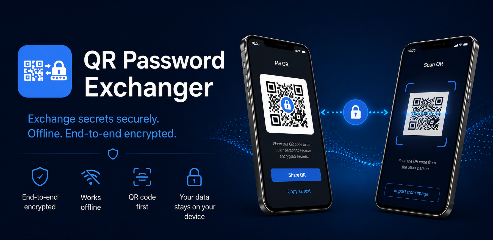
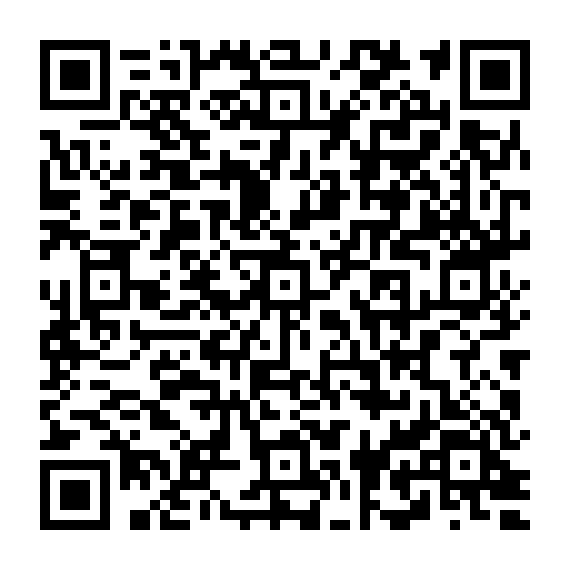
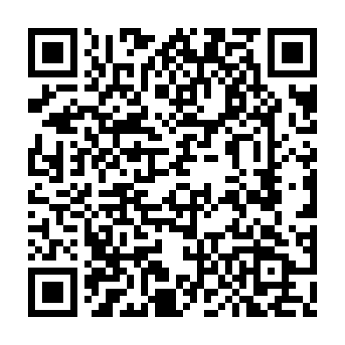

# QR Password Exchanger

QR Password Exchanger is a simple utility for securely sharing passwords and other secrets.

Instead of sending passwords in plain text through WhatsApp, Signal, Microsoft Teams, email, or other messaging platforms, users encrypt secrets for a specific recipient before sharing them.

Only the holder of the private key corresponding to the selected public key can decrypt the message.

---

# Downloads

Scan a QR code with your phone, or use the link below it, to download the latest version from the official app stores.

<table>
  <tr>
    <td align="center">
      
       
      <strong>Android</strong>
       
      <a href="https://play.google.com/store/apps/details?id=com.coelnerapps.qrpasswordexchanger">Get it on Google Play</a>
    </td>
    <td align="center">
      
       
      <strong>iPhone &amp; iPad</strong>
       
      <a href="https://apps.apple.com/app/qr-password-exchanger/id6780361762">Download on the App Store</a>
    </td>
  </tr>
</table>

---

# Key Features

- End-to-end encryption
- Public/private key cryptography
- No accounts
- No project-operated servers
- No project-operated cloud storage
- No subscriptions
- No advertising
- No tracking
- Works completely offline

---

# Typical Workflow

1. Exchange public keys once.
2. Save each other as contacts.
3. Enter a password or other secret.
4. Encrypt it for a specific recipient.
5. Share the encrypted message through WhatsApp, Signal, Microsoft Teams, email, QR codes, or any other communication channel.
6. The recipient decrypts the message locally on their own device.

The communication channel transports only the encrypted message and never has access to the original secret.

---

# Typical Use Cases

- Sharing passwords with family members
- Sharing Wi-Fi credentials
- Sending API keys
- Sending recovery codes
- Transferring access credentials between devices

---

# Desktop CLI

This repository already contains a small Linux command-line reference implementation that can:

- generate compatible key pairs,
- encrypt messages compatible with the mobile apps,
- decrypt messages produced by the mobile apps.

This makes it possible to exchange encrypted secrets between desktop systems and Android or iOS devices.

---

# Documentation

- [QPE v1 wire format](docs/protocol/qpe-v1.md) — the implemented public-key and encrypted-message format
- [Desktop CLI interoperability](docs/protocol/cli-interop.md) — exchange QPE messages with Android and iOS using the included scripts
- [Security model and limitations](docs/security-model.md) — what the current design protects and what it does not

---

# Project Status

QR Password Exchanger is still an early-stage project.

The mobile applications are available through the official app stores but are still gaining real-world testing across the wide variety of Android and iOS devices.

The user interface and feature set will continue to evolve.

The versioned QPE message format is intended to remain stable going forward. Future protocol extensions will use explicit envelope versions and/or algorithm identifiers to preserve compatibility whenever practical.

---

# Open Source

The mobile applications are intended to become fully open source.

Before publishing the repository, I want to complete one additional review to ensure no credentials, development artifacts, or other unintended information are included in the project history.

If you have a legitimate reason to inspect the source code earlier—for example for a security review, interoperability work, or to contribute to the project—feel free to contact me:

**martx.labs@gmail.com**

---

# Reporting Bugs

Bug reports, suggestions, and pull requests are welcome.

If you discover what you believe to be a **security vulnerability**, please **do not create a public GitHub issue**. Instead, report it privately to:

**martx.labs@gmail.com**

This gives me the opportunity to investigate and fix the issue before public disclosure.

---

# Security Notice

No software can guarantee absolute security.

QR Password Exchanger is designed so that private keys remain on the user's device and encrypted messages can be transported through untrusted communication channels.

Users remain responsible for protecting:

- their devices,
- their private keys,
- their device backups,
- and the physical security of their devices.

Loss of a private key may permanently prevent access to previously received encrypted messages.

For the current cryptographic and application boundaries, see the [security model and limitations](docs/security-model.md).

---

# License

The desktop CLI and documentation contained in this repository are licensed under the project's license.

The mobile application source code will be added once it is published.
